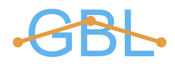

# General Broken Lines
### Track refitting with broken lines in 3D

There are three versions of GBL provided:
* A Python version, located in the `python/` directory
* A FORTRAN version in the `fortran/` directory, here a simple Makefile is included
* A C++ version which can be compiled and installed as described below


## C++ Version

### Dependencies
* CMake, version 3.1 or later
* Eigen3
* (option) [ROOT](https://root.cern.ch/building-root). The support of ROOT for user input and output is configured via `-DSUPPORT_ROOT=ON/OFF`.

### Build procedure
If you've already worked with CMake, the following steps should be known.
The build philosophy is to encourage out-of-source builds, but this is not enforced.

Execute the following steps:
  1) create a compilation directory, e.g. 'build' and change into it
      ```
      mkdir build; cd build
      ```
  2) create the Makefile by invoking cmake on the configuration file (similar to the usual ./configure step of autotools)
      ```
      cmake ..
      ```
  3) start the build process
      ```
      make
      ```

As a result of successful compilation, the shared library will be created in the `lib/` sub directory, and the executable example can be found in `bin/`.

### Installation
If you want to use the General Broken Lines as a project in another CMake managed project, or want (slightly) simpler path also invoke:

```
make install
```

This will create some configuration files for inclusion and also create the lib/ and bin/ directory in the directory of the source code.
The install directory can be changed by adding `-DCMAKE_INSTALL_PREFIX=<prefix>` as argument to the CMake command.

## Documentation
To build the documentation, you need Doxygen (version > 1.7.0 recommended ) on your system.
Invoke, also in the build directory:

```
make doc
```

All steps in one:
The shortest way to build everything, if you have the required packages installed (CMake, root and doxygen) is to execute from the current (project root) directory (e.g. copy and execute the following line):
        mkdir build; cd build; cmake ..; make; make doc; make install
